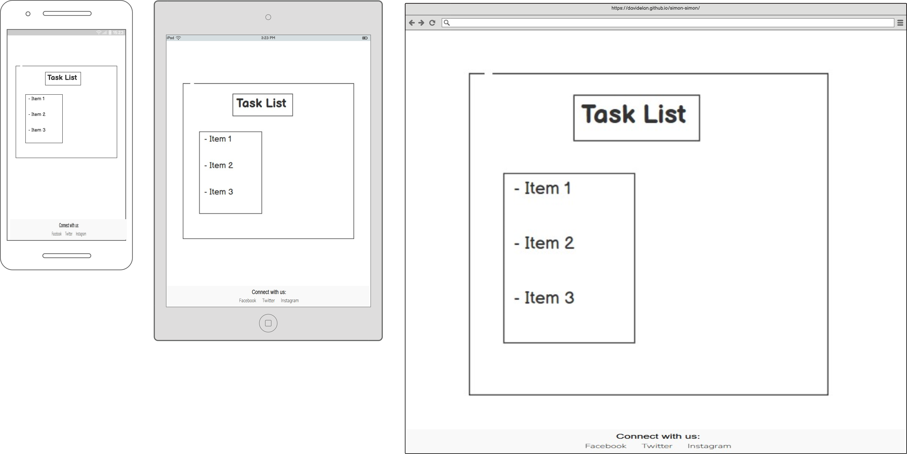

# TO-DO list Creator
Full-Stack Toolkit Portfolio Project(PP4) - Code Institute

View the deployed site [here.](https://davide-todo-list-ada1093e37d7.herokuapp.com/) 

 *TO-DO list Creator* is a website that lets you create a TO-DO list with a list of tasks. The user can create multiple tasks and give names to each one of them. The user can, for example, have a food shopping TO-DO list with items to by at the supermarket.
 The user can create an account, login in, modify and delete the TO-DO list's items. 
 It is a full-stack Django project running on Heroku.

  

## Table of contents

- [User Experience](#user-experience)
  - [User stories](#user-stories)
- [Design](#design)
  - [Wireframes](#wireframes)
  - [Typography](#typography)
- [Structure](#structure)
- [Database](#database)
- [Features](#features)
- [Bugs](#bugs)
- [Technologies Used](#technologies-used)
  - [Languages](#languages)
  - [Tools](#tools)
  - [Frameworks](#frameworks)
  - [Libraries and modules](#libraries-and-modules)
- [Testing](#testing)
  - [Validator Testing](#validator-testing)
  - [Lighthouse Test](#lighthouse-test)
  - [Manual testing](#manual-testing)
  - [Browser Compatibility](#browser-compatibility)
  - [Automated Testing](#automated-testing)
- [Deployment](#deployment)
  - [Heroku](#heroku)
  - [Local deployment](#local-deployment)
  - [Forking this GitHub repository](#forking-this-github-repository)
  - [Clone this repository](#clone-this-repository)
  - [Create PostgreSQL using Code Institute Database Maker](#create-postgresql-using-code-institute-database-maker)
  - [Gmail](#gmail)
- [Credits](#credits)
  - [Content](#content)
  - [Code](#code)
  - [ReadMe](#readme)
  - [Acknowledgments](#acknowledgments)

## User Experience

This project was designed using Agile methodology, utilising the Project Board and Issues sections in GitHub 
The Project board can be seen [here](https://github.com/users/davidelan/projects/3/views/1).

### User stories

THe TODO list creator is meant for anyone who wants to create a todo list.  

User Stories with their id:   

- As a Site User I can view the content of the todo list so that I can read the full text. [#2](https://github.com/davidelan/todo-list/issues/2)

- As a Site User I can create an account so that I can log in into m y account. [#3](https://github.com/davidelan/todo-list/issues/3)

- As a Site Admin/Registered User I can create todo lists' Items so that I can manage my site content. [#8](https://github.com/davidelan/todo-list/issues/8)

- As a Site Admin/Registered User I can view a todo list item so that I can view my site content. [#9](https://github.com/davidelan/todo-list/issues/9)

- As a Site Admin/Registered User I can update a todo list item so that I can manage my site content. [#10](https://github.com/davidelan/todo-list/issues/10)

- As a Site Admin/Registered User I can Delete a todo list item so that I can manage my site content. [#11](https://github.com/davidelan/todo-list/issues/11)

- As a Site Admin/Registered User I can log in to my account so that I can mange todo lists' items. [#12](https://github.com/davidelan/todo-list/issues/12)

- As a Site Admin/Registered User I can log out from my account so that no one can have access to my data. [#13](https://github.com/davidelan/todo-list/issues/13)

- As a site user I can set a task box as completed so that I can focus on non-completed tasks. [#16](https://github.com/davidelan/todo-list/issues/16)

- As a Site User I can search for a task in the task list so that I view the desired task. [#17](https://github.com/davidelan/todo-list/issues/17)

- As the superuser I can access the site's administrative features so that I have access to the admin panel. [#18](https://github.com/davidelan/todo-list/issues/18)

## Design

### Wireframes

- All devices - Landing Page Wireframe

- All devices - Registration Wireframe

- All devices - Task List Wireframe

### Imagery
 
The background image was found at Pexels and was created by [Suzy Hazelwood]:(https://www.pexels.com/photo/notebook-1226398/) It was used to create the colour palette and logo. 
The background image is a picture of a ring notebook where usually people write down todo lists.

#### Colour Scheme:
  
I kept the color scheme very simple and I used two different shades of green, one for the main base page (login, registration, task list and task list update and deletion) and for the complition of a task.

### Typography

[Mulish](https://fonts.google.com/specimen/Mulish) was used across the whole project with the only exception of the text "Connect with us:" in the footer in which I used the standard Arial font. 

## Structure 

The final database schema is the representation of the two database models that were later implemented. As you can see from the image there are more fields than what were used in the project. This is becasue I started with the idea of having multiple TODO Lists which each could contain multiple taks. I would have liked to also show the user for both categories hte date of creation and update. Unfortunately I realized near the submission deadline that I would not have time to implement all the ideas and I had to revert to the simplest version. 
It is my intention to proceed with the above implementation when the course has ended.

 

## Database 
I used a PostgreSQL provided by Code Institute as relational database. 

- **FieldTypes:** 
  - AutoField: An integer field that automatically increments.
  - CharField: A text field with a maximum length.
  - DateTimeField: A field for storing date and time.
  - TextField: A large text field.
  - ForeignKey: A many-to-one relationship.
  - IntegerField: An integer field.
  - BooleanField: A boolean field.

- **Relationships:** 
  - A User has one TODO list.
  - A User can create many Tasks in the TODO list.
  - A Task belongs to the TODO list.

## Features

 - See the landing page / login page

- The user can create an account

- View todo list and all its tasks

- The user can create or edit a task

- The user can delete a task

### Features, which I would like to implement in the future

- The main feature that I would like to implement is to have multiple todo lists. 
- I would also like to add informnation about the date of the creation and updating of the tasks.
- It would be nice to also have a priority system which would support the user in choosing the sequence of tasks to complete
- Definitely improve the look of the app and that of the landing page

# Technologies Used

Here the list technologies used to carry out the project:

- [GitPod](https://gitpod.io/) - IDE used to create the site. To build and create this project.
- [GitHub](https://github.com/) used to save and store the files for the website.
- [Git](https://git-scm.com/) used in conjunction with Gitpod to commit code to the GitHub repository.
- [Heroku](https://www.heroku.com) was used to deploy the application.
- [Code Insitute Database Maker](https://dbs.ci-dbs.net/) PostgreSQL database hosting for this project
- [Balsamiq](https://balsamiq.com/) used to create the wireframes.
- [Lucid](https://lucid.app/) used to create the Flowchart.
- [Beautifier](https://beautifier.io/) to beautify the HTML code
- [Pexels](https://www.pexels.com/) used to find a background image for the project.
- [Browserling](https://www.browserling.com/) used to test the application on different browsers. 
- [Google Chrome Dev Tools](https://developer.chrome.com/docs/devtools) used to check the application for responsiveness and errors. 

# Programming Languages, Frameworks and Libraries Used

- [HTML](https://developer.mozilla.org/en-US/docs/Web/HTML)
- [CSS](https://developer.mozilla.org/en-US/docs/Learn/Getting_started_with_the_web/CSS_basics)
- [Python](https://en.wikipedia.org/wiki/Python_(programming_language))
- [Django](https://www.djangoproject.com/)

# Agile

In order to develop the project using the Agile methodology, the GItHub Project Board and Issues were used.

- [Project Board](https://github.com/users/davidelan/projects/3)

# Testing

Please, go to [TESTING.md](TESTING.md) to see a detailed report of the testing of the project.

