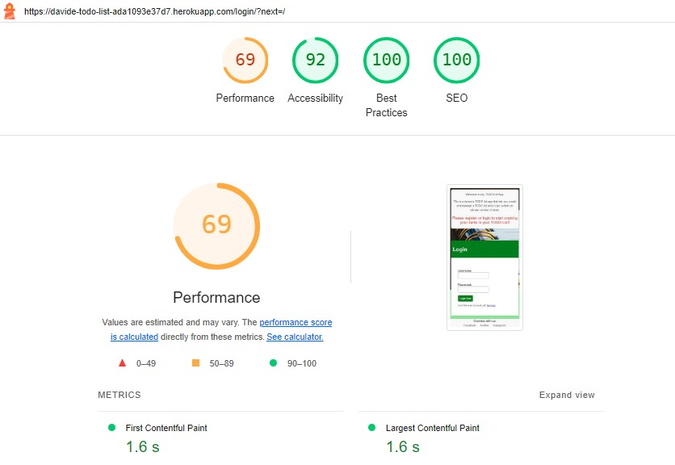
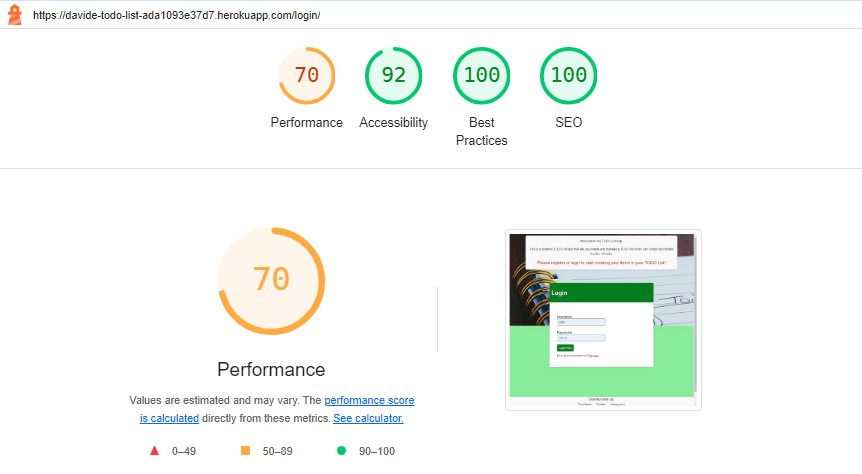
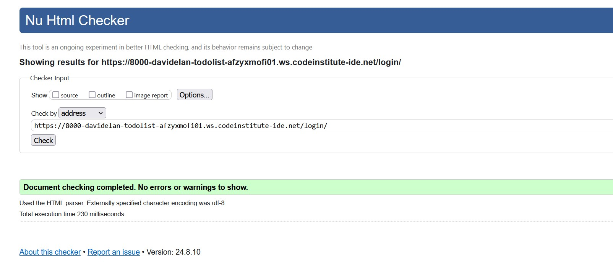
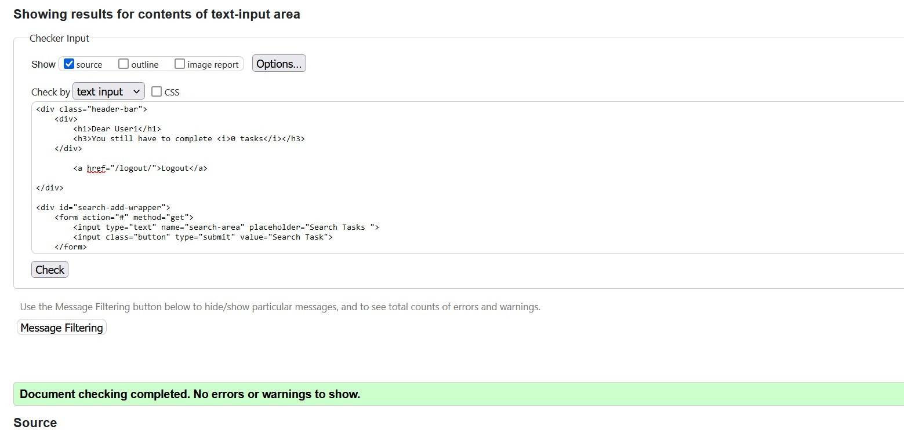
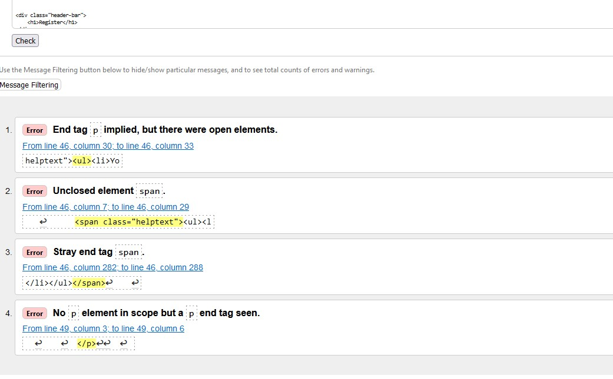
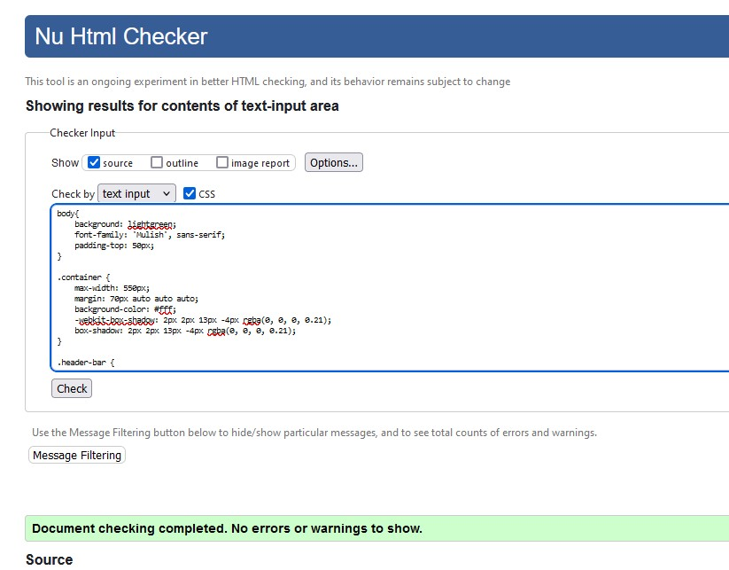

# Testing

During this project, I tested each section or function/model as it was built, addressing any functionality or styling issues that arose. These issues were corrected before moving forward. Additionally, external people tested the site by signing up, creating, editing and deleting tasks on various devices and platforms (iOS, Android, mobile, tablet, etc.). They adviced me about any problems they encountered with functionality or styling. The testing is reported in the tables below.

## Manual Testing

### Admin

| TEST | OUTCOME | PASS/FAIL|
|:---:|:---:|:---:|
| Login as superuser | Access the admin login page | Pass |
| Manage user accounts | add, update and delete users. | Pass |
| Manage tasks | add, update and delete a tasks. | Pass |

### User

| TEST | OUTCOME | PASS/FAIL|
|:---:|:---:|:---:|
| Create Task | Task successfully created and displayed | Pass |
| Read task title and description | Task displayed correctly | Pass |
| Edit Task | Task successfully created and displayed | Pass |
| Delete Task | Task successfully deleted | Pass |
| Mark Task as completed | Task successfully checked as completed | Pass |
| Search Task | Task found using search option | Pass |
| Check username and password validity | Error message if username or passwords do not comply to rules | Pass |
| Create Account | Account created successfully | Pass |
| Login | Login Successful | Pass |
| Logout | Logout Successful | Pass |

## Bugs

One of my users reported that they were unable to sign up when including an email address (although the inclusion of an email address is not required), but myself and others were unable to replicate this issue so the bug was marked as closed.

Throughout this project, I encountered several styling bugs, typically after adding a new section or template page. I resolved these issues by inspecting the page and by adjusting some CSS styling.

Towaeds the deadline of the project submission I experienced a corrupted database. The problem required a database reset, which I managed to achieve with the invaluable help of the Code Institute's Tutor Support. 

I had several times issues with pushing the code to GitHub. For some reasons that I still don't know, there were inconsistencies between commits. Three times I had to force the push command (git push -f).

Huge problem when I wanted to revert the project to an earlier commit. Something went wrong with the reset command and I lost a great amount of work. 

## Lighthouse

The following testing was done using the Lighthouse in Chrome DevTools. It has audits for performance, accessibility, progressive web apps and SEO.

Mobile

Desktop

## Validation Testing

### HTML

HTML testing was carried out using [W3 Validator](https://validator.w3.org/)

  - result for 'login' page 

 

  - result for 'task list' page 

 

  - result for 'registration' page 

 

*In this case the error messages are due to the django built in User auth. It is therefore code created by django and not my code!*

### CSS

CSS testing was completed using [W3 Validator](https://validator.w3.org/)

 

## Python Testing

Python pep8 validation was done via [Code Institute's Python Linter](https://pep8ci.herokuapp.com/)

All created python files were checked with the Code Insitute validator - CI Python Linter. After removing some lines that were too long, everything was clear, and no errors were found.

The only errors found were related to some files which cotained some lines that were too long. After shortening the affected lines, no further errors were found.  

Python Files Tested:

- models.py
- views.py
- urls.py
